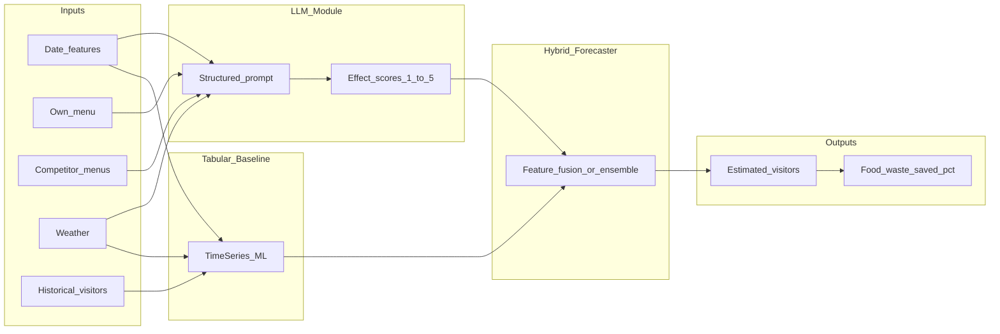

# LunchLens: Menu-Aware Forecasting for Less Food Waste

> *See tomorrow's lunch crowd before the soup hits the pot.*

Every day, campus kitchens cook for a crowd they can't see. **LunchLens** is a hybrid AI forecaster that reads the menu, checks the weather, scans what competitors are serving, and estimates how many people are actually coming. Less guesswork. Less waste. More lunch.

---

## LunchLens at a Glance

| | |
|---|---|
| **Problem** | Campus kitchens over-prepare → avoidable food waste |
| **Approach** | ML baselines + LLM menu intelligence (hybrid fusion) |
| **Outputs** | Estimated daily visitors + food waste saved (%) |
| **Deliverable** | Open benchmark, ablation study, reproducible eval harness |
| **Good for** | Restaurants, sustainability teams, applied ML researchers |

---

## 1. The Problem

It's 10:30 AM. The kitchen starts prepping for 200 lunches. But it's pouring rain, the student guild is serving free pizza two buildings away, and today's special is liver casserole. By 2 PM, half the trays come back untouched. This happens every week — not because anyone is careless, but because **demand is invisible until it's too late**.

Campus and neighborhood lunch spots prep on gut feel. Prices are roughly the same across nearby competitors — so what actually moves the needle is **today's menu**, **the weather**, **what day it is**, and **what everyone else is serving**. Over-prepare → food in the bin. Under-prepare → angry students and lost revenue.

### Research Questions

- **RQ1:** Does a **hybrid model** (tabular ML + LLM menu intelligence) beat classical forecasting on daily visitor count?
- **RQ2:** If we sharpen the forecast, **how much simulated food waste** disappears under realistic prep policies?
- **RQ3:** What actually matters most — weather, your own menu, or competitor menus? (Ablation study)

> *"We're not building another dashboard. We're asking a research question with a real sustainability payoff."*

This is not a shallow "AI predicts X" demo. LunchLens connects LLM reasoning to an operational sustainability metric (waste %), with measurable baselines and an open benchmark others can extend.

---

## 2. How LunchLens Works

LunchLens reads the signals a head chef already thinks about — then quantifies them. Numbers from ML. Context from LLMs. One forecast.



### Three steps

1. **Look back** — historical visitor counts + date patterns (tabular baselines)
2. **Look around** — weather API, competitor menus, today's own menu (LLM scores each factor 1–5)
3. **Look ahead** — hybrid model outputs **estimated visitors** + **waste saved (%)** vs. naive baseline prep

### Pipeline modules

| Module | Role | Methods |
|--------|------|---------|
| **Data layer** | Realistic synthetic daily records + public weather/competitor menu text | Synthetic generator with controllable seasonality, weekday effects, weather correlation; public weather API (FMI/OpenWeather); optional scraped public lunch menus as text |
| **Baseline forecaster** | Predict visitors from tabular features only | Historical mean by weekday, linear regression, gradient boosting (XGBoost/LightGBM), optional Prophet/ARIMA |
| **LLM signal module** | 1–5 effect scores on demand drivers | Structured prompt: date context, own menu, competitor menus, weather → JSON with per-factor scores (1–5) and brief rationale |
| **Hybrid fusion** | Combine tabular + LLM signals | Early fusion (append LLM scores as features) + late fusion (weighted ensemble); compare both |
| **Waste metric** | Translate forecast quality into sustainability impact | Prep quantity ∝ forecast + buffer; waste = max(0, prep − actual); report **waste saved % vs naive baseline** |

### The LLM twist

The LLM doesn't hallucinate visitor counts. It **rates demand signals** on a 1–5 scale — menu appeal, competitor pressure, weather pull — like a sharp regular who knows the neighborhood. Those scores feed the forecaster as structured features.

**LLM input:** date, own menu, competitor menus nearby, weather summary

**LLM output (JSON):**

```json
{
  "menu_appeal": 4,
  "competitor_pressure": 2,
  "weather_effect": 3,
  "overall_demand_signal": 3.5,
  "rationale": "Rain reduces walk-ins; guild pizza nearby is strong competition."
}
```

**Guardrails:** JSON schema validation, 1–5 clamp, logged prompts and responses for reproducibility.

> *"If we cut forecast error by 15%, how much food stays out of the bin?"*

### Ablation study (expected comparison)

| Model | What it knows | Hypothesis |
|-------|---------------|------------|
| Naive | Last week's average | Baseline to beat |
| + Weather | Rain/cold effects | Small lift |
| + LLM menu | Semantic menu appeal | Does text help? |
| + Competitors | Local competition context | Full picture |
| **LunchLens full** | Everything fused | Best forecast → most waste saved |

---

## 3. Who It's For

This starts on campus. It doesn't stay there.

| Who | Why they'll care |
|-----|------------------|
| **Campus cafés & lunch spots** (Aalto, Teekkarikylä) | Prep the right amount — less waste, fewer stockouts |
| **Sustainability teams** | A number they can report: estimated waste saved (%) |
| **ML / NLP researchers** | Open hybrid benchmark on short text (menus) + time series |
| **Future Open Source Lab teams** | Fork it, plug in real data, run the same eval |

**Honest scope note:** The MVP runs on **realistic synthetic data** — because we're researchers, not data-brokers. The architecture is designed for a **future pilot with one partner restaurant**. That's the roadmap, not a blocker.

---

## 4. What We Ship

One semester. One focused team. Something worth open-sourcing — not a weekend hack.

### In scope

- Synthetic dataset generator (~6–12 months of daily records, 1 virtual restaurant + 3 competitors)
- Public weather ingestion for Helsinki/Aalto area
- 3 tabular baselines + 1 hybrid model
- LLM scoring module with fixed prompt template and JSON schema
- Ablation study + short results write-up (2–4 pages)
- Open-source repo: data generation, training, evaluation, prompts

### Out of scope (deliberately)

- Production dashboard or POS integration
- Real-time competitor menu scraping at scale
- Multi-location deployment
- Price elasticity modeling (assumption: price parity across competitors)

### 10-week arc

| Phase | Weeks | Milestone |
|-------|-------|-----------|
| **Ground truth** | 1–3 | Synthetic data + tabular baselines |
| **Menu brain** | 4–5 | LLM scorer + prompt v1 |
| **Fusion & fight** | 6–8 | Hybrid model + ablation study |
| **Ship it open** | 9–10 | Reproducible repo + results write-up |

---

## 5. Why This Matters

Food waste isn't abstract. It's trays coming back full while someone else goes hungry. LunchLens won't fix the whole system — but it asks the right question with the right tools, and leaves behind something the next team can actually build on.

- **Tech for Good:** Turn forecasting error into a waste metric people can feel
- **Technical depth:** Time series + structured LLM outputs + ablation — not a prompt demo
- **Open-source gift:** Benchmark generator, eval harness, prompt templates — fork and extend
- **Student-driven energy:** Learn by building something that could matter on your own campus

> *"We go beyond courses. We build, we measure, we share."*

---

## Judging Criteria — How LunchLens Delivers

| Criterion | How LunchLens addresses it |
|-----------|---------------------------|
| **Impact & relevance** | Campus lunch you can picture; waste % tied directly to forecast quality |
| **Feasibility** | Synthetic data removes the data blocker; clear 10-week phases; Python + one LLM API |
| **Clarity** | Tagline → hook → diagram → ablation table. Judges get it in 60 seconds |
| **Technical depth** | Hybrid fusion, ablation study, waste simulation under prep policies |
| **Open-source / research value** | Public benchmark + eval scripts + prompt templates = shareable artifact |

---

## Risks & Mitigations

| Risk | Mitigation |
|------|------------|
| No real restaurant data initially | Realistic synthetic generator with controllable ground-truth correlations; path to partner pilot |
| LLM cost / latency | Batch offline scoring for research; cache all prompt/response pairs |
| Menu text variability | Structured prompts + JSON schema validation |
| Waste metric is modeled, not measured | Clearly labeled as simulated savings under stated prep assumptions (see Appendix B) |

---

## Appendix A: Synthetic Data Schema

The synthetic generator produces one row per restaurant-day. Ground-truth visitor counts are generated from known latent factors so ablation results are interpretable.

### Core fields

| Field | Type | Description |
|-------|------|-------------|
| `date` | date | Calendar date |
| `day_of_week` | int (0–6) | Monday = 0 |
| `is_holiday` | bool | Finnish public holiday flag |
| `week_of_semester` | int | Academic calendar position (higher → more campus traffic) |
| `weather_temp_c` | float | Daily mean temperature (°C) |
| `weather_precip_mm` | float | Daily precipitation (mm) |
| `weather_condition` | string | e.g. `clear`, `rain`, `snow` |
| `own_menu_text` | string | Today's menu items (free text) |
| `own_menu_popularity_score` | float (0–1) | Latent ground truth — not given to model |
| `competitor_1_menu` | string | Nearest competitor menu |
| `competitor_2_menu` | string | Second competitor menu |
| `competitor_3_menu` | string | Third competitor menu |
| `competitor_pressure_score` | float (0–1) | Latent aggregate competitor attractiveness |
| `visitor_count` | int | Ground-truth daily visitors (target variable) |
| `nominal_capacity` | int | Restaurant seating / typical max throughput |

### Ground-truth generation (controllable correlations)

```
visitor_count = base_dow_effect
              + semester_boost
              + weather_effect(temp, precip)
              + menu_popularity_effect(own_menu_popularity_score)
              - competitor_pressure_effect(competitor_pressure_score)
              + noise(N(0, σ))
```

- **Weekday effects:** Tuesday–Thursday peak; Monday/Friday moderate; weekend low (campus context)
- **Weather:** Rain and cold reduce walk-ins; mild sunny days increase them
- **Menu popularity:** Drawn from a pool of ~40 menu templates with assigned latent scores (e.g. "burger + fries" > "liver casserole")
- **Competitor pressure:** When a competitor serves a high-popularity item (e.g. pizza day), demand drops proportionally
- **Noise:** Gaussian noise (σ ≈ 8–12% of mean) to simulate real-world variance

### Competitor structure

Three virtual competitors within ~500 m:

| Competitor | Style | Typical menu pattern |
|------------|-------|---------------------|
| Comp 1 | Student guild café | Pizza, cheap daily specials |
| Comp 2 | Chain lunch spot | Standardized rotating menu |
| Comp 3 | Salad/soup bar | Light options, weather-sensitive |

Price is assumed equal across all venues (per project constraint).

### Dataset size

- **Training:** 9 months (~270 days)
- **Validation:** 1.5 months (~45 days)
- **Test:** 1.5 months (~45 days)
- Fixed random seed for reproducibility

---

## Appendix B: Evaluation Protocol

### Forecast metrics

| Metric | Formula / definition | Purpose |
|--------|---------------------|---------|
| **MAE** | mean(\|predicted − actual\|) | Interpretable error in visitors |
| **RMSE** | sqrt(mean((predicted − actual)²)) | Penalizes large misses |
| **MAPE** | mean(\|predicted − actual\| / actual) × 100 | Scale-free comparison across periods |

All metrics computed on the held-out test set. Report mean ± std across 3 random seeds.

### Food waste simulation

Waste is **simulated**, not measured — clearly labeled in all outputs.

**Prep policy:**

```
prep_quantity = predicted_visitors + safety_buffer
safety_buffer = max(10, 0.10 × predicted_visitors)   # 10% buffer, minimum 10 portions
```

**Waste calculation:**

```
actual_waste   = max(0, prep_quantity − actual_visitors)
baseline_waste = max(0, baseline_prep − actual_visitors)
```

where `baseline_prep` uses the **naive weekday historical average** (same safety buffer applied).

**Waste saved (%):**

```
waste_saved_pct = (baseline_waste − actual_waste) / baseline_waste × 100
```

Report aggregate waste saved % across the test set for each model in the ablation table.

### Ablation matrix

Each row adds one signal class. All models share the same train/val/test split and prep policy.

| Run ID | Model | Features available |
|--------|-------|--------------------|
| A0 | Naive weekday mean | Day-of-week historical average only |
| A1 | Tabular + date | Day-of-week, holiday, week-of-semester |
| A2 | A1 + weather | + temperature, precipitation, condition |
| A3 | A2 + LLM menu scores | + menu_appeal, overall_demand_signal from LLM |
| A4 | A3 + LLM competitor scores | + competitor_pressure from LLM |
| A5 | **LunchLens full (hybrid)** | A4 fused with gradient boosting on all tabular + LLM features |

### Reproducibility checklist

- [ ] Fixed random seeds (Python, NumPy, model)
- [ ] All LLM prompts and responses logged to `data/llm_logs/`
- [ ] Prompt template versioned in `prompts/menu_demand_v1.txt`
- [ ] Config file for generator parameters (`configs/synthetic.yaml`)
- [ ] Single command to reproduce full ablation: `python -m src.eval.run_ablation`

### LLM scoring protocol

- Model: configurable (e.g. GPT-4o-mini or open-source equivalent)
- Temperature: 0 (deterministic)
- Output: JSON only, validated against schema
- Scores clamped to [1, 5] after parsing
- Each (date, menu, weather, competitors) tuple scored once and cached

---

*LunchLens — Aalto AI Open Source Lab proposal*
